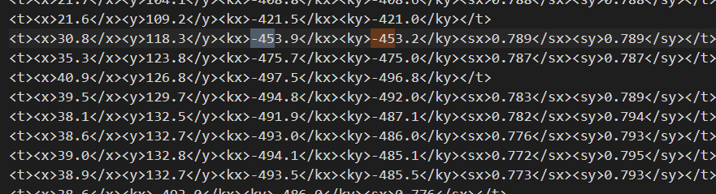

# 动画
{: id="20210316144501-jf9m8ih" updated="20210316153659"}

所有动画均使用原版一代动画文件生成
{: id="20210316153705-3n3k43s" updated="20210316153706"}

## 原版动画文件
{: id="20210315213133-ukjibtw" updated="20210316153708"}

### 动画文件的解析
{: id="20210315184121-pwctzji" updated="20210316153714"}

原版动画使用flash 制作完成，以fla文件保存在游戏中,只有年度版游戏才能找到。编辑此类文件需要下载 类似 flash cs6等软件
{: id="20210315184122-0bz0xjx" updated="20210315231826"}

{: parent-style="display: block; text-align: center;"}
{: id="20210315184420-f32jz9o" updated="20210315212346"}

fla动画文件通过FlashReanimExport.jsfl脚本转化为reanim问价
{: id="20210315184420-srhdzeo" updated="20210315212545"}

{: parent-style="display: block; text-align: center;"}
{: id="20210315212503-julyg6r" updated="20210315231856"}

部分代码
{: id="20210315212503-el0ngk6" updated="20210315231857"}

```js
var element = elementArray[0];
	var BaseElementAndMatrix = FindBaseElementAndMatrix(element, elementIndex);
	var baseElement = BaseElementAndMatrix.baseElement;
	var matrixFinal = BaseElementAndMatrix.matrixFinal;
	var numElements = BaseElementAndMatrix.numElements;

	var skewX = Math.atan2(matrixFinal.b, matrixFinal.a);
	var skewY = Math.atan2(matrixFinal.c, matrixFinal.d);

	var quarterPi = 0.785398163;

	var sx;
	var sy;
	if (Math.abs(skewX) < quarterPi || Math.abs(skewX) > quarterPi * 3)
	{
		sx = matrixFinal.a / Math.cos(skewX);
	}
	else // need to switch way to get scale when cos() is near 0
	{
		sx = matrixFinal.b / Math.sin(skewX);
	}
	if (Math.abs(skewY) < quarterPi || Math.abs(skewY) > quarterPi * 3)
	{
		sy = matrixFinal.d / Math.cos(skewY);
	}
	else // need to switch way to get scale when cos() is near 0
	{
		sy = matrixFinal.c / Math.sin(skewY);
	}
```
{: id="20210315184120-a4i81o6" updated="20210315215002"}

而转换后的reanim本质是一个xml文件,看脚本的注释和源码可以知道reanim文件的具体结构
{: id="20210315214957-6z9kaud" updated="20210315231908"}

### reanim文件的解析
{: id="20210315212745-ij8on20" updated="20210315220632"}

普通僵尸的部分胳膊动画
{: id="20210315215238-h0qdx2z" updated="20210315215308"}

```
<track>
<name>anim_innerarm3</name>
<t><x>24.4</x><y>81.2</y><kx>354.2</kx><ky>354.2</ky><sx>0.800</sx><sy>0.800</sy><i>IMAGE_REANIM_ZOMBIE_INNERARM_HAND</i></t>
<t><x>24.5</x><y>79.7</y><kx>356.7</kx><ky>356.7</ky><sx>0.799</sx><sy>0.799</sy></t>
<t><y>78.2</y><kx>359.0</kx><ky>359.0</ky></t>
<t><x>24.6</x><y>76.7</y><kx>361.0</kx><ky>361.0</ky></t>
<t><y>75.3</y><kx>363.5</kx><ky>363.5</ky></t>
<t><x>24.7</x><y>76.1</y><kx>361.3</kx><ky>361.3</ky></t>
<t><x>24.8</x><y>76.6</y><kx>359.5</kx><ky>359.5</ky><sx>0.798</sx><sy>0.798</sy></t>
<t><x>24.9</x><y>77.3</y><kx>357.5</kx><ky>357.5</ky></t>
<t><x>25.1</x><y>77.9</y><kx>355.5</kx><ky>355.5</ky></t>
<t><x>25.2</x><y>78.5</y><kx>353.4</kx><ky>353.4</ky></t>
<t><x>25.4</x><y>79.1</y><kx>351.2</kx><ky>351.2</ky></t>
<t><x>25.3</x><y>78.8</y><kx>353.0</kx><ky>353.0</ky></t>
<t><x>25.1</x><y>78.6</y><kx>354.7</kx><ky>354.7</ky></t>
<t><x>25.0</x><y>77.8</y><kx>357.0</kx><ky>357.0</ky></t>
<t><x>24.9</x><y>76.9</y><kx>359.2</kx><ky>359.2</ky></t>
<t><x>24.8</x><y>76.2</y><kx>361.3</kx><ky>361.3</ky><sx>0.799</sx><sy>0.799</sy></t>
<t><x>24.6</x><y>75.3</y><kx>363.5</kx><ky>363.5</ky></t>
<t><x>25</x><y>76.9</y><kx>361.0</kx><ky>361.0</ky></t>
<t><x>25.3</x><y>78.5</y><kx>358.7</kx><ky>358.7</ky></t>
<t><x>25.8</x><y>80.0</y><kx>356.2</kx><ky>356.2</ky></t>
<t><x>26.2</x><y>81.6</y><kx>353.7</kx><ky>353.7</ky></t>
<t><x>26.6</x><y>83.1</y><kx>351.2</kx><ky>351.2</ky></t>
<t><x>27.1</x><y>84.6</y><kx>348.7</kx><ky>348.7</ky></t>
<t><x>26.7</x><y>84.8</y><kx>349.7</kx><ky>349.7</ky></t>
<t><x>26.2</x><y>85.1</y><kx>350.7</kx><ky>350.7</ky></t>
<t><x>25.8</x><y>84.1</y><kx>351.7</kx><ky>351.7</ky></t>
<t><x>25.4</x><y>83.1</y><kx>352.5</kx><ky>352.5</ky></t>
<t><x>24.9</x><y>82.1</y><kx>353.4</kx><ky>353.4</ky></t>
<t><x>24.4</x><y>81.2</y><kx>354.2</kx><ky>354.2</ky><sx>0.800</sx><sy>0.800</sy></t>
<t></t>

``````
{: id="20210315213024-bcm93ty" updated="20210315215226"}

#### 基本标签
{: id="20210315213158-0c1oz4t" fold="1" updated="20210315213215"}

| 标签  | 作用                                                                           |
| ------- | -------------------------------------------------------------------------------- |
| track | 分割标签,将动画以图片的形式分割                                                |
| t     | 每个标签,代表一帧的数据                                                        |
| f     | 标志位 当其中值为-1时表示动画至此结束往后不在使用该标签，为0时表示重新开始使用 |
| fps   | 内部数据即为每秒显示的帧数                                                     |
| name  | 动作名字                                                                       |
{: id="20210315213341-lqjjy0t" updated="20210315214647"}

#### 内容标签
{: id="20210315213238-6lwpbhr" updated="20210315213630"}

以下内容包含在每一帧中，如果当前帧没有设置标签，表示沿用了上一帧的数据,除非之前遇到了终止使用的
{: id="20210315213843-j1gu1qg" updated="20210315214051"}

````html
<f>-1</f>
````
{: id="20210315214051-5x12oeo" updated="20210315214144"}

| 标签 | 作用                                                  |
| ------ | ------------------------------------------------------- |
| x    | x坐标                                                 |
| y    | y坐标html                                             |
| i    | 使用图片名字，如果名字中含有"IMAGE_REANIM_"就将其移除 |
| sx   | 图片宽度的拉伸                                        |
| sy   | 图片高度的拉伸                                        |
| kx   | 图片x轴的偏转角度                                     |
| ky   | 图片y轴的偏转角度                                     |
{: id="20210315213631-qp5bqys" updated="20210315214016"}

#### 速度数据
{: id="20210315215846-uaxov41" updated="20210315215922"}

```html
<name>_ground</name>
```
{: id="20210315215923-2wjoqgv" updated="20210315220103"}

即为速度数据，每一帧的速度均不相同，用固定速度无法完全还原原版的效果
{: id="20210315215846-k79p6ai" updated="20210315220111"}

### 动画的保存和读取
{: id="20210315215846-jh57qsj" updated="20210315222054"}

原版文件过于奇葩(你甚至可以在xml中找到旋转-490度。。。)
{: id="20210315215352-z5xkmnh" updated="20210315220136"}


{: id="20210315215501-nydfkdl" updated="20210315215502"}

将其转化为较为容易操作的json数据
{: id="20210315215439-3w7gxr6" updated="20210315215527"}

{: id="20210409162703-9kf15dc"}

### json文件的解析
{: id="20210409162703-zx4pb8u" updated="20210409162921"}

```
{
    "explode": {
        "actionList": [
            [
                {
                    "x": "31.0",
                    "y": "17.1",
                    "kx": "28.3",
                    "ky": "28.3",
                    "sx": "0.599",
                    "sy": "0.599",
                    "i": "cherrybomb_leftstem"
                },
                {
                    "x": "4.0",
                    "y": "30.9",
                    "sx": "0.800",
                    "sy": "0.800",
                    "i": "cherrybomb_left1",
                    "kx": 0,
                    "ky": 0
                }
            ]
        ]
    },
    "idle": {
        "actionList": [
            [
                {
                    "x": "31.0",
                    "y": "17.1",
                    "kx": "28.3",
                    "ky": "28.3",
                    "sx": "0.599",
                    "sy": "0.599",
                    "i": "cherrybomb_leftstem"
                },
                {
                    "x": "4.0",
                    "y": "30.9",
                    "kx": "0.0",
                    "ky": "0.0",
                    "sx": "0.800",
                    "sy": "0.800",
                    "i": "cherrybomb_left1"
                }
      
            ]
        ]
    }
}
```
{: id="20210409162708-jovz0o1" updated="20210409162914"}

{: id="20210409162708-j0mbjgz"}

python脚本如下
{: id="20210315220139-d7hbwd8" updated="20210315220211"}

```python
import re
import json

from bs4 import BeautifulSoup

def filter_use_data(content):
    pattern = re.compile(r'<name>(\w+)</name>')
    l = pattern.split(content)[1:]
    i = 0
    q = {}
    result = []
    for s in l:
        if i % 2 == 0:
            q = {"name": s}
        else:
            q["content"] = s
            result.append(q)
        i = i + 1
    return result

def replenish_omit_data(image_xml_data):
    content = image_xml_data['content']
    soup = BeautifulSoup(content, 'html.parser')
    frame_list = soup.find_all('t')
    pre_frame_data = None
    use_pre = False
    image = None
    final_data = []
    index = 0
    is_none = False
    for frame in frame_list:
        json_data = {}
        if pre_frame_data is not None:
            use_pre = True
        for arg in frame.children:
            arg_name = arg.name
            arg_data = arg.string
            if arg_name == "i":
                arg_data = arg_data.replace("IMAGE_REANIM_", "").lower()
                image = arg_data
            json_data[arg_name] = arg_data
            if arg_name == "f":
                if arg_data == "-1":
                    is_none = True
                    use_pre = False
                else:
                    is_none = False
        if image is None:
            is_none = True
        replenish_args_default_map = {'sx': 1, 'sy': 1, 'kx': 0, 'ky': 0, 'x': 0, 'y': 0, "i": None}
        index = index + 1
        if not is_none and pre_frame_data is not None and use_pre:
            for replenish_arg in replenish_args_default_map:
                if replenish_arg not in json_data and replenish_arg in pre_frame_data:
                    json_data[replenish_arg] = pre_frame_data[replenish_arg]

        if not is_none:
            for replenish_arg in replenish_args_default_map:
                if replenish_arg not in json_data:
                    json_data[replenish_arg] = replenish_args_default_map[replenish_arg]
            pre_frame_data = json_data
            if image is not None:
                json_data["i"] = image
        else:
            pre_frame_data = None

        final_data.append(json_data)
    if image is not None:
        print(image_xml_data['name']+"   "+image)
    image_xml_data['content'] = final_data


def getFrame(num, l):
    result = []
    for i in l:
        content = i["content"][num]
        q = {}
        for k in content:
            if content[k] is not None:
                q[k] = content[k]
        if len(q) != 0:
            result.append(q)
    return result


def remove_action_data(image_xml_data_list):
    action_map = {}
    need_remove_map = {}
    for image_data in image_xml_data_list:
        content = image_data['content']
        empty = True
        filter_name = image_data['name'].replace("anim_", "")
        for json_data in content:
            if "i" in json_data:
                empty = False
        need_remove_map[filter_name] = empty
        if "anim_" in image_data['name'] and empty:
            action_map[filter_name] = {}
    filter_data_list = []
    for image_data in image_xml_data_list:
        filter_name = image_data['name'].replace("anim_", "")
        if not need_remove_map[filter_name]:
            filter_data_list.append(image_data)
        index = 0
        content = image_data['content']
        if filter_name not in action_map:
            continue
        begin = None
        over = None
        if "f" not in content[0] or content[0]["f"] == 0:
            begin = 0
        for c in content:
            if begin is not None and over is not None:
                break
            if begin is None and len(c) > 0:
                if not ("f" in c and c['f'] == "-1"):
                    begin = index
            if over is None and begin is not None and len(c) > 0:
                if "f" in c and c['f'] == "-1":
                    over = index - 1
            index = index + 1
        if over is None:
            over = index - 1
        action_map[filter_name]['begin'] = begin
        action_map[filter_name]['over'] = over
    image_xml_data_list.clear()
    for filter_data in filter_data_list:
        image_xml_data_list.append(filter_data)
    return action_map


def c_build(begin, over, all_image_data_list):
    result = []
    i = begin
    while i <= over:
        child_result = []
        for image_data_list in all_image_data_list:
            data = image_data_list['content'][i]
            if "f" in data:
                data.pop("f")
            if len(data) > 0:
                child_result.append(image_data_list['content'][i])
        i = i + 1
        result.append(child_result)
    return result


def speed_build(begin, over, speed_data):
    result = []
    i = begin

    while i <= over:
        result.append(speed_data[i])
        i = i + 1
    return result

def get_speed_data(original_data_list):
    result = []
    content = None
    now_x = None
    for data in original_data_list:
        if data['name'] == '_ground':
            content = data['content']
    for frame in content:
        speed = 0
        if "f" in frame:
            if frame["f"] == "0":
                speed = 0
                now_x = float(frame['x'])
            else:
                speed = 0
        elif "x" not in frame:
            speed = 0
        else:
            x = float(frame['x'])
            if (now_x == None):
                now_x = x
            speed = '%.4f' % (x - now_x)
            now_x = x
        result.append(float(speed))

    return result


if __name__ == '__main__':
    name = "BaseZombie"
    with open(name + '.reanim') as file_obj:
        content = file_obj.read()
    original_data_list = filter_use_data(content)

    new_list = []
    for original_data in original_data_list:
        replenish_omit_data(original_data)

    speed_data = get_speed_data(original_data_list)
    action_map = remove_action_data(original_data_list)
    result = {}

    for action in action_map:
        data = action_map[action]
        result[action] = {}
        result[action]['actionList'] = c_build(data['begin'], data['over'], original_data_list)
        speedList = speed_build(data['begin'], data['over'], speed_data)
        speedList = speedList[1:] + [0]
        result[action]['speedList'] = speedList

    with open("C:\\Users\\Administrator\\Desktop\\" + name + ".json", "w", encoding='utf-8') as f:
        f.write(json.dumps(result))
        f.close()
```
{: id="20210315220212-e3z44cs" updated="20210315220214"}

### 动画渲染
{: id="20210315215611-t96s9m1" updated="20210315220831"}

{: id="20210315220658-bjdofym" updated="20210316145919"}

> 别用java写游戏就对了
> {: id="20210409162338-6wj3odi"}
{: id="20210316145929-eq6h7gi"}

javaFx代码 swing 用AffineTransform就行
{: id="20210315221831-aop0vrf" updated="20210315221837"}

```java
public void draw( float x, float y,
            float sx, float sy,
            float kx, float ky,Image image) {
  
        while (kx < 0) kx = kx + 360;
        while (ky < 0) ky = ky + 360;
        int rotateNum = 0;
        while (kx >= 45 && kx >= 45) {
            kx = kx - 90;
            ky = ky - 90;
            rotateNum++;
        }
        double degreeX = kx / 180.0 * Math.PI;
        double degreeY = ky / 180.0 * Math.PI;
        double shearX = -Math.tan(degreeY);
        double shearY = Math.tan(degreeX);
        double scaleX = sx * Math.abs(Math.cos(degreeX));
        double scaleY = sy * Math.abs(Math.cos(degreeY));
        Affine affine = new Affine();
        affine.appendRotation(rotateNum* 90, x, y);
        affine.appendShear(shearX, shearY, x, y);
        affine.appendScale(scaleX, scaleY, x, y);
        graphicsContext.setTransform(affine);
        graphicsContext.drawImage(drawImage, x, y);
        graphicsContext.restore();
    }

```
{: id="20210315220938-19mblbs" updated="20210315221855"}

## 代码层面
{: id="20210315221014-8dpottp" updated="20210315222127"}

动画配置如下，每个文件生成的全部动画全配置好
{: id="20210316143652-565qud2" updated="20210316143835"}

```json
{
  "baseZombie": {
    "file": "json/zombie/BaseZombie.json",
    "baseKey": "b-z",          //缓存key
    "height": 120,            //缓存key
    "width": 30,             //无法确定碰撞范围，所以自行peizhi
    "needAction": [//需要的动作，大多数是暂时不需要的，比如超长的super_long_death
      "walk",
      "walk2",
      "eat",
      "death",
      "death2"
    ],
    "animations": {
      "innerArm": {
        "fragments": [
          "zombie_innerarm_upper",
          "zombie_innerarm_hand",
          "zombie_innerarm_lower"
        ]
      },
      "head": {
        "fragments": [
          "zombie_head",
          "zombie_jaw"
        ]
      },
      "immutable": {
        "fragments": [
          "zombie_tie",
          "zombie_body",
          "zombie_outerleg_lower",
          "zombie_outerleg_foot",
          "zombie_outerleg_upper",
          "zombie_innerleg_foot",
          "zombie_innerleg_lower",
          "zombie_innerleg_upper",
          "zombie_neck"
        ]
      },
      "healthCone": {
        "fragments": [
          "zombie_cone1"
        ]
      },
      "brokenCone": {
        "fragments": [
          "zombie_cone1"
        ],
        "replace": {
          "zombie_cone1": "zombie_cone2"
        }
      }
    }
  }
}
```
{: id="20210316143741-kunzuo4" updated="20210316144013"}

| key        | 意义                                                               |
| ------------ | -------------------------------------------------------------------- |
| file       | 要是用的动画未见                                                   |
| baseKey    |                                                                    |
| height     | 设置某个高度为绘制起点，图片最低部会变化，所以无法通过碎片动态设置 |
| width      | 无法确定碰撞范围，所以自行配置                                     |
| needAction | 需要的动作，大多数是暂时不需要的，比如超长的super_long_death       |
{: id="20210316144157-ys7lbno" updated="20210316153804"}

因为不是每个碎片的动画都需要显示，所以一个动画被拆成了很多动画，
{: id="20210316144520-hwg10ev" updated="20210316144611"}

普通僵尸就被拆成了immutable(不可变),head(头),innerArm(靠里的胳膊),brokenOutArm(靠外的被破坏胳膊),outArm(靠外胳膊)
{: id="20210316144614-rcg2qtb" updated="20210316144843"}

| key       | 意义                                                                           |
| ----------- | -------------------------------------------------------------------------------- |
| fragments | 动画需要绘制的碎片                                                             |
| replace   | 图片替换，钢盔在损坏的时候后替换为破损的钢盔                                   |
| clash     | 使用此动画时，不可以同时显示的动画，比如抓门板的手和普通状态下的手无法同时显示 |
{: id="20210316144639-gdzmuqh" updated="20210316145254"}

### AnimationData
{: id="20210316145334-z2std6s" updated="20210316145340"}

动画数据
{: id="20210316145343-76scap4" updated="20210316145851"}

> 别用java写游戏
> {: id="20210316145852-836x3np"}
{: id="20210316145511-14txdff" updated="20210316145852"}

java缓存的动画数据，无状态，记录了每个动作每一帧的数据
{: id="20210316145347-z4ldytt" updated="20210316153845"}

### Animation
{: id="20210316145441-0f3j4mp" updated="20210316145448"}

每个**Sprite**都有的对象，对于**Sprite**来说，**Sprite**把动作和播放速度传给**Animation**对象，**Animation**负责绘制，对于僵尸来说**Animation**还会返回每一帧需要的移动速度
{: id="20210316145219-djtas6c" updated="20210316145908"}

{: id="20210316145615-br26e38"}


{: id="20210315183920-9b7kccy" type="doc"}
